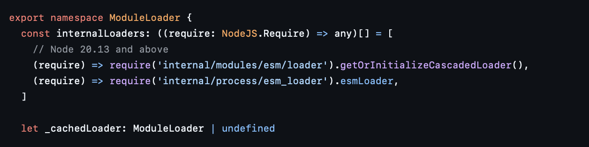
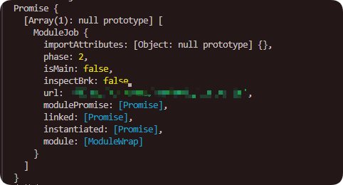
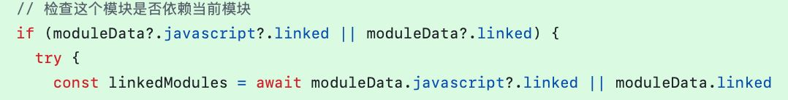

# 背景

## Node.js ESM 环境中的 HMR 限制

HMR（Hot Module Replacement / Hot Module Reload，模块热替换或热重载）是一种在应用运行时替换、更新模块代码而无需重启进程的技术。在前端开发中，像 Vite、Webpack 等打包器早已普遍支持 HMR，让开发者能即时预览修改效果。

在 Node.js 后端环境中，HMR 的可行性与所使用的模块系统密切相关：

- **CommonJS (CJS)**  
  CJS 模块在加载时，`require` 会将模块实例缓存到 `require.cache` 这个 `Map` 中。开发者可以直接操作该缓存（例如删除条目），让下次 `require` 时重新加载模块，从而实现热替换。

- **ECMAScript Module (ESM)**  
  ESM 的 `import` 是 JavaScript 语法关键字，由 V8 引擎内部处理。Node.js 在实现中将动态导入函数 `import()` 也封装为了 V8 层面的语法钩子，不暴露任何对应的模块缓存结构。  
  这意味着在 ESM 环境下，开发者无法像在 CJS 那样通过操作 `require.cache` 来控制模块生命周期，直接造成了 HMR 场景下**缓存不可见、无法失效**的问题。

这就是 **Node.js ESM 环境中的 HMR 限制**：模块缓存不透明，缺少官方 API 删除或替换模块实例，使得无打包器环境下的热重载实现难度大大增加。

# ESM HMR难点

## CJS vs. ESM

ESM 和 CJS 是两种不同的模块系统。其中 CJS 是 Node.js 在十多年前引入的，而 ESM 在近几年逐步成为了 JavaScript 开发的标准，它们之间的最大区别是导入和导出一个模块的方式:

```javascript
// ESM
import fs from 'node:fs'
export function run() {}
```

```javascript
// CJS
const fs = require('fs')
module.exports.run = function () {}
```

## ESM的HMR

HMR 即模块热替换(Hot Module Replacement)，在业务模块的开发过程中，任意保存一个源码文件，都可以在其他业务模块不停机的情况下，重载这个模块的代码。这对插件化框架开发极为有用。

目前，网络上常见的模块热替换基本为通过import缓存的是URL这一特性添加query等不影响URL地址内容的额外字符，让每次导入都使用不同的URL，防止导入被缓存的模块，实际上内部在每次加载还是会缓存URL，严重时可能导致内存泄露。

在某些框架如[Koishi](https://koishi。chat)中，支持通过require.cache删除已经加载的模块来实现HMR，但require.cache仅仅在 CJS 环境下可用。在 ESM 环境下加载的模块根本不会写入这个对象。你可以在许多 issue 中看到人们对此的抱怨和请求：

- [ESM module reloading and module graph · Issue #51 · nodejs/tooling · GitHub 2](https://github.com/nodejs/tooling/issues/51)
- [hot reload modules w/ es6 modules · Issue #459 · nodejs/modules · GitHub 2](https://github.com/nodejs/modules/issues/459)
- [Invalidate cache when using import · Issue #49442 · nodejs/node · GitHub 3](https://github.com/nodejs/node/issues/49442)

在2024年的Koishi v5预告中，Koishi声称实在其元框架Cordis上实现了**互联网上首个无需打包器的 ESM HMR 完整技术广泛应用的完整技术方案之一**。

最终Koishi设计了两套完整的算法来解决上述问题。目前在 Cordis 仓库中使用的是其中一套。它基于一些 Node.js 内部 API，可以在守护进程中使用。后续如果有时间，Koishi也可能切换到另一套实现，它不依赖任何内部 API 就能安全地解决 CJS-ESM 多例和 ESM HMR 问题。

这里主要讲第一套方法(其实是作者也不知道第二种😰)。

# 使用暴露内部模块实现的ESM环境HMR

## --expose-internals

这是一个神奇的参数，在Node.js官方文档中没有任何记载，只在其博客的更新日志中少有提到，貌似是早期Node.js为了方便test引入的参数。

该参数可以暴露Node.js JavaScript内部internals组中的模块，而我们的loadCache就在internal/modules/esm/loader中，由此我们可以通过添加该参数来操作loadCache，从而实现HMR。

## loadCache 和 ModuleJob

`internal/modules/esm/loader` 里导出的 `loadCache` 是一个 `Map<url， ModuleJob>`：

- **url**: 模块的标准化 URL（file://形式）
- **ModuleJob**: 负责执行模块加载生命周期（解析 - 链接 - 执行）

HMR 需要删除一个模块以及所有直接或间接依赖它的 ModuleJob，这样下次 `import()` 时 Node.js 会重新解析和执行代码，而不是直接复用已缓存的实例。

## 实现要点

### 导入模块

模块路径如图所示:



### 依赖重载

在完成了基本的模块缓存删除后，我们意识到在某个模块清除缓存后，它的嵌套模块也需要被清理。

那么此时我们就需要分析重载边界，这时，我们发现，在ModuleJob中有一个键为linked的列表，内容如下图所示:



这时候我们意识到，linked中就是某个模块的依赖!

但是要注意，在某些情况下，linked的位置有两个，这是因为 Node ESM loader 里在不同加载阶段引用的依赖集存储位置不同(可执行阶段或链接阶段)，如下图所示:



我们只需要从插件入口开始遍历每个依赖，然后获取每个模块的依赖项，构建图结构查找即可。

## 注意事项

### 不应纳入重载范围的模块

在遍历依赖图或清理缓存时，应当跳过 Node.js 自带的内部模块和内置依赖，例如：

- `node:` 开头的内置模块（如 `node:fs`、`node:path` 等）
- Node.js runtime 内部的虚拟模块（如 `internal/*` 等）
- 第三方依赖的模块（一般位于 `node_modules` 目录下），除非你确实需要热重载它

原因是这些模块通常是运行时的基础设施，**删除它们的缓存有可能导致整个进程不稳定甚至崩溃**；并且它们的代码几乎不会在开发过程中频繁改动，也不需要纳入 HMR 重载范围。

### 关于 Effect Space（副作用空间）

即便我们清理了模块缓存并重新加载代码，Node.js 进程中依然可能存在由旧代码遗留的运行时状态，例如：

- 已注册的事件监听器
- 定时器（setInterval / setTimeout）
- 数据库连接
- 全局单例对象
- 在全局作用域挂载的属性

这些运行时残留被称为 **Effect Space**（副作用空间）。  
热重载只是保证代码重新执行，**无法自动消除副作用空间**。  
如果模块存在副作用，就需要提供显式的清理方法（如 `dispose` 钩子）来在 HMR 前解除绑定或释放资源，否则多次热重载可能造成内存泄漏和逻辑冲突。

### 生产环境不推荐

本方案依赖 `--expose-internals` 暴露的 Node.js 内部模块，该 API 并未文档化，仅在早期Node.js的提交中偶然出现，没有稳定性保障，可能在任何版本更新中被修改或移除。同时，访问内部对象可能带来潜在的安全风险，并破坏 Node.js 运行时的内部状态。  
建议仅在本地开发或调试环境中启用，不要直接用于线上生产系统。

# 结语

相比 CJS，Node.js ESM 在架构上更现代，但也带来了 HMR 方面的空白。本文所述方案通过 `--expose-internals` 获取 `loadCache` 并结合依赖图分析，实现了无需打包器的 ESM 热重载，这为调试和本地开发提供了更多可能。

从更长远的角度看，ESM HMR 的理想方案应该是安全、稳定、无内存泄漏且不依赖内部实现的——如 Koishi 团队的第二套不依赖内部 API 的实现，或社区推动 Node.js 官方暴露受控的模块缓存管理接口。

Node.js ESM HMR 依然是一块需要更多探索的领域。无论是推动官方 API 的开放，还是构建不依赖内部机制的实现，社区的持续研究与分享都将加速这一能力的成熟落地。
